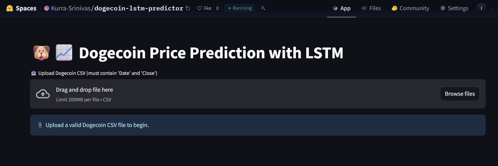

# 🐶📈 Dogecoin Price Predictor (LSTM-based)

Get ready to predict Dogecoin prices with the power of LSTM!

Dive into the world of cryptocurrency forecasting with this deep learning project! Using LSTM (Long Short-Term Memory) networks, this app predicts Dogecoin (DOGE) prices by analyzing historical data. Whether you're a crypto enthusiast or a data science learner, this project offers a blend of sequence modeling, time series forecasting, and interactive visualization.

## 🚀 Project Overview

- 📊 Input Data: Historical DOGE-USD prices
- 🤖 Model Type: LSTM Neural Network (with Keras & TensorFlow backend)
- 🧠 Features: Closing price series (scaled), time-based sequence modeling
- 🎯 Objective: Predict future closing prices of Dogecoin
- 📉 Visualizations: Loss curve, actual vs predicted, residual diagnostics, future price projection

---
## 📌 Highlights

- ✅ Built and trained a custom LSTM network on preprocessed crypto time series
- ✅ Achieved strong performance on test set (R² score, low residuals)
- ✅ Visualized residual distribution, model diagnostics, and future forecasts
- ✅ Saved model and scaler for real-time or batch inference
- ✅ Deployed on Hugging Face using Streamlit

---

## 🌐 Live Demo on Huggingface 🤗


👉 [Try the App on Hugging Face Spaces](https://huggingface.co/spaces/Kurra-Srinivas/dogecoin-lstm-predictor-lstm-based)
---
## 🧰 Tech Stack

| Tool/Library       | Purpose                         |
|--------------------|---------------------------------|
| Python (3.12)      | Core programming language       |
| TensorFlow/Keras   | LSTM Model Building & Training  |
| Scikit-learn       | Metrics, preprocessing          |
| Pandas, NumPy      | Data manipulation               |
| Matplotlib, Seaborn| Plotting & visualization        |
| Streamlit          | Web app deployment              |
| Git/GitHub         | Version control & collaboration |

---

## 📂 Project Structure

```
📁 Dogecoin-LSTM-Predictor/
│
├── DOGE-USD.csv                   # Raw historical Dogecoin data
├── dogecoin_lstm.ipynb           # Main Jupyter Notebook (core logic)
├── lstm_stock_model.keras        # Trained LSTM model (Keras format)
├── scaler.save                   # Saved MinMaxScaler for future inference
│
├── actual_vs_predicted.png       # Visualization of model performance
├── residual_distribution.png     # Histogram + KDE of residuals
├── residual_diagnostics.png      # Residuals vs predicted plot
├── loss_curve.png                # Training loss progression
├── future_price_prediction.png   # Future forecasted prices
│
└── README.md                     # This file ✨
```

---

## 📈 Sample Results

| Metric            | Value              |
|-------------------|--------------------|
| R² Score (Test)   | ~0.90+             |
| MAE / MSE         | Low (well-optimized) |

---

## 🧪 How to Run

```bash
# 1. Clone the repo
git clone https://github.com/Kurra-Srinivas/Dogecoin-LSTM-Predictor.git
cd Dogecoin-LSTM-Predictor

# 2. (Optional) Create virtual environment
python -m venv venv
source venv/bin/activate  # or venv\Scripts\activate on Windows

# 3. Install requirements
pip install -r requirements.txt

# 4. Run the Streamlit app
streamlit run app.py
```

---
## 🙋‍♂️ Author

**Kurra Srinivas**  
📧 Email: [srinivaskurra886@gmail.com](mailto:srinivaskurra886@gmail.com)  
🔗 LinkedIn: [https://www.linkedin.com/in/kurra-srinivas-31727420b/](https://www.linkedin.com/in/kurra-srinivas-31727420b/)  
🐙 GitHub: [Kurra-Srinivas](https://github.com/Kurra-Srinivas)  
